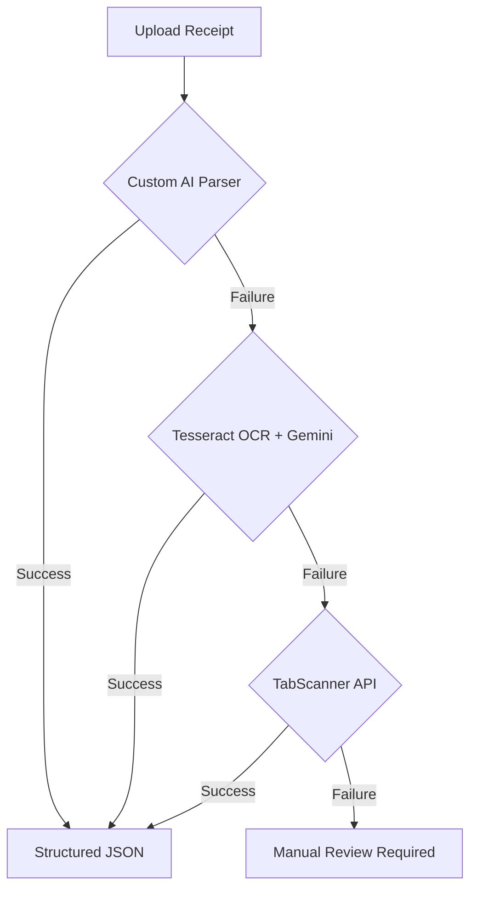
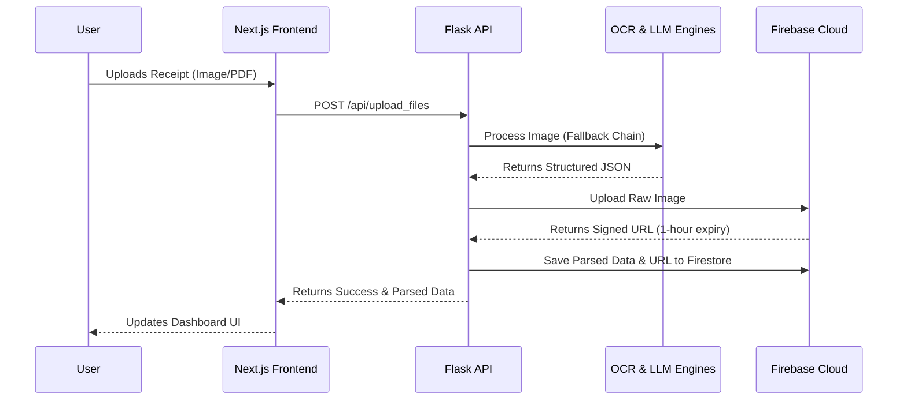

<div align="center">
  <h1>🧾 Advanced OCR Receipt Scanner</h1>
  <p><strong>A modern, full-stack application that leverages Optical Character Recognition (OCR) and Artificial Intelligence to automatically scan, parse, categorize, and analyze your receipts.</strong></p>

  [](https://opensource.org/licenses/MIT)
  [](https://www.python.org/)
  [](https://nextjs.org/)
  [](https://flask.palletsprojects.com/)
  [](https://firebase.google.com/)
  [](https://tailwindcss.com/)
</div>

<hr />

## 📖 Table of Contents
- [🌟 Key Features](#-key-features)
- [🛠️ Tech Stack](#️-tech-stack)
- [🏗️ System Architecture](#️-system-architecture)
- [📁 Project Structure](#-project-structure)
- [🚀 Getting Started](#-getting-started)
  - [Prerequisites](#prerequisites)
  - [Backend Setup](#backend-setup)
  - [Frontend Setup](#frontend-setup)
- [⚙️ Environment Variables](#️-environment-variables)
- [🛡️ Security Measures](#️-security-measures)
- [🌐 API Overview](#-api-overview)
- [🚀 Deployment](#-deployment)
- [🗺️ Roadmap](#️-roadmap)
- [🤝 Contributing](#-contributing)
- [📄 License](#-license)

---

## 📸 Screenshots

*(Add your screenshots here)*
- **Dashboard View:** Shows the high-level metrics and recent scans.
- **AI Advisor:** Demonstrates a chat session with the AI financial advisor.
- **Upload Flow:** The interface for uploading and previewing OCR data.

---

## 🌟 Key Features

### Intelligent Receipt Parsing (Multi-Layered)
Our parsing pipeline is designed for maximum reliability and accuracy. It extracts merchant names, transaction dates, total amounts, taxes, discounts, and itemized lists using a robust fallback chain:


1. **Custom AI Parser:** Attempts to extract data using an optimized custom model.
2. **Local Tesseract OCR + Google Gemini LLM:** If the custom model fails, it falls back to local Tesseract OCR, feeding the raw text into Gemini to intelligently structure the JSON.
3. **TabScanner API:** The ultimate fallback if the receipt is highly degraded or handwritten.

### Interactive Dashboard & Visualization
- **Beautiful Charts:** View spending trends over time, category breakdowns (e.g., Groceries, Dining, Travel), and recent activity using modern charting libraries.
- **Data Vault:** Filter, sort, and manage your digital receipt vault effortlessly.

### AI Financial Advisor
- **Context-Aware:** Chat with an AI advisor (powered by Gemini) that analyzes your exact receipt history.
- **Actionable Insights:** Get personalized budgeting tips, identify spending anomalies, and receive advice on where you can cut costs.

### Semantic & Voice Search
- **Natural Language:** Find past receipts using conversational queries like "grocery trips last month over $50" or "coffee shop visits in New York".
- **Voice Input:** Seamlessly use your microphone to dictate search queries.

### Secure Authentication & Data Isolation
- **Robust Auth:** JWT-based authentication with strict password hashing (Bcrypt).
- **Absolute Privacy:** Users only ever see their own data. The backend strictly enforces ownership checks via JWT identities, preventing IDOR (Insecure Direct Object Reference) vulnerabilities.

### Cloud Storage & Export
- **Ephemeral URLs:** Scanned images and PDFs are safely stored in Firebase Storage using short-lived (1-hour) signed URLs to prevent unauthorized access.
- **Data Portability:** Export your parsed data directly to CSV for use in Excel, Quickbooks, or other accounting software.

---

## 🛠️ Tech Stack

### Backend Architecture
- **Core Framework:** Python 3.9+ / Flask
- **Database:** Firebase Firestore (NoSQL Document Store)
- **File Storage:** Firebase Storage
- **OCR Engine:** Tesseract OCR (Local) & TabScanner API
- **Generative AI:** Google Gemini API
- **Security & Auth:** Flask-JWT-Extended, Flask-Bcrypt, Flask-Limiter, Flask-CORS

### Frontend Architecture
- **Core Framework:** Next.js (React 18) with App Router
- **Styling:** Tailwind CSS for responsive, utility-first design
- **State Management:** React Context API
- **Data Fetching:** Native Fetch API with Bearer token authorization

---

## 🏗️ System Architecture



1. **Client Request:** The user uploads a receipt image (JPG/PNG) or PDF via the Next.js frontend.
2. **Backend Processing:** Flask receives the file securely, validating its MIME type and enforcing size limits (16MB).
3. **Data Extraction Pipeline:**
   - The file is routed to the local OCR engine (Tesseract).
   - Raw text is extracted and sent to the LLM (Gemini) with a strict prompt for structured JSON parsing.
   - If local processing fails or confidence is low, the fallback TabScanner API is engaged.
4. **Cloud Persistence:** The raw image is uploaded to Firebase Storage. A secure, time-limited signed URL is generated.
5. **Database Storage:** The structured receipt data (merchant, amounts, categories) and the signed URL are linked to the user's ID and saved in Firestore.
6. **Client Response:** The parsed data is immediately returned to the user's dashboard for review and editing.

---

## 📁 Project Structure

```text
advanced-ocr-receipt-scanner/
├── frontend/                 # Next.js Application
│   ├── src/
│   │   ├── app/              # Next.js App Router pages
│   │   ├── components/       # Reusable UI components
│   │   └── context/          # React Context (Auth, etc.)
│   └── public/               # Static assets
├── routes/                   # Flask Blueprints (API Endpoints)
│   ├── auth_routes.py        # Login, Register, Logout
│   ├── receipt_routes.py     # CRUD operations for receipts
│   ├── report_routes.py      # Analytics and CSV export
│   └── upload_routes.py      # File upload and processing
├── services/                 # Core Business Logic
│   ├── db_service.py         # Firestore interactions
│   └── receipt_service.py    # Parsing pipeline orchestrator
├── ocr/                      # OCR Engines and Fallbacks
│   ├── engine.py             # Tesseract logic
│   ├── llm_parser.py         # Gemini integration
│   └── tabscanner.py         # Tabscanner API integration
├── app.py                    # Flask application entry point
├── config.py                 # Application configuration
└── extensions.py             # Flask extensions (JWT, Bcrypt)
```

---

## 🚀 Getting Started

### Prerequisites
- [Python 3.9+](https://www.python.org/downloads/)
- [Node.js 18+](https://nodejs.org/)
- [Tesseract OCR](https://github.com/tesseract-ocr/tesseract) installed and accessible in your system's PATH.
  - **Windows:** Download the installer from UB-Mannheim.
  - **Mac:** `brew install tesseract`
  - **Linux:** `sudo apt-get install tesseract-ocr`
- A **Firebase Project** with Firestore and Storage enabled.
- API Keys for **Google Gemini** and **TabScanner**.

### Backend Setup

1. **Clone the repository:**
   ```bash
   git clone https://github.com/yourusername/advanced-ocr-receipt-scanner.git
   cd advanced-ocr-receipt-scanner
   ```

2. **Create a virtual environment and install dependencies:**
   ```bash
   python -m venv venv
   source venv/bin/activate  # On Windows: venv\Scripts\activate
   pip install -r requirements.txt
   ```

3. **Configure Environment Variables:**
   Copy the example environment file:
   ```bash
   cp .env.example .env
   ```
   **Important:** You must generate secure keys for `SECRET_KEY` and `JWT_SECRET_KEY`:
   ```bash
   python -c "import secrets; print(secrets.token_hex(64))"
   ```

4. **Add Firebase Credentials:**
   Place your Firebase Admin SDK service account key JSON file in the root directory and name it `firebase_credentials.json`, or set the `GOOGLE_APPLICATION_CREDENTIALS` environment variable pointing to the file.

5. **Run the Backend Development Server:**
   ```bash
   python app.py
   ```
   The backend will run on `http://127.0.0.1:5000`.

### Frontend Setup

1. **Navigate to the frontend directory:**
   ```bash
   cd frontend
   ```

2. **Install dependencies:**
   ```bash
   npm install
   ```

3. **Configure Frontend Environment:**
   Create a `.env.local` file in the `frontend` directory if you need to override the default API URL:
   ```env
   NEXT_PUBLIC_API_URL=http://127.0.0.1:5000
   ```

4. **Run the Frontend Development Server:**
   ```bash
   npm run dev
   ```
   The frontend will run on `http://localhost:3000`.

---

## ⚙️ Environment Variables

### Backend (`.env`)
| Variable | Description |
|----------|-------------|
| `SECRET_KEY` | Flask application secret (min 64 chars recommended). Used for session signing. |
| `JWT_SECRET_KEY` | Key used to sign JWT tokens (min 32 chars required). Do not expose this. |
| `GEMINI_API_KEY` | API key for Google Gemini LLM (used for parsing and AI Advisor). |
| `TABSCANNER_API_KEY` | API key for TabScanner fallback OCR engine. |
| `FIREBASE_STORAGE_BUCKET`| Name of your Firebase storage bucket (e.g., `your-app.appspot.com`). |
| `FLASK_DEBUG` | Set to `False` in production. Enables detailed error tracing locally. |
| `OCR_CONFIDENCE_THRESHOLD` | Minimum confidence score to accept local OCR results before falling back. |
| `PORT` | The port the Flask app binds to (default: 5000). |

---

## 🛡️ Security Measures

This project has been extensively audited for security and includes the following protections:

- **Strict IDOR Prevention:** All endpoints strictly derive the `user_id` from the secure JWT payload. Client-provided IDs are never trusted for database mutations (like editing or deleting receipts).
- **Token Revocation:** Logging out adds the user's JWT to a server-side blocklist, invalidating it immediately.
- **Rate Limiting:** Protects auth and upload endpoints against brute-force and DDoS attacks (e.g., 5 logins per minute). Global limits apply to all other routes.
- **CORS Hardening:** Cross-Origin Resource Sharing is strictly limited to known frontend URLs to prevent cross-site request forgery.
- **No Public Cloud Blobs:** Firebase Storage blobs are kept private. The app generates short-lived (1-hour) signed URLs for client viewing.
- **Input Sanitization:** Search queries and file uploads are truncated and sanitized to prevent Prompt Injection and Path Traversal. Pagination parameters are bounded to prevent memory exhaustion.
- **No Credentials Leakage:** Error handlers are sanitized to prevent stack traces from leaking environment variables or path structures.

---

## 🌐 API Overview

The backend provides a RESTful API under the `/api/` prefix.

### Authentication
- `POST /api/register` - Create a new user account.
- `POST /api/login` - Authenticate and receive a JWT.
- `POST /api/logout` - Revoke the current JWT.
- `GET /api/me` - Get the current user's profile.

### Receipts
- `GET /api/receipts` - List all receipts for the current user (supports pagination).
- `GET /api/receipt/<id>` - Retrieve a specific receipt.
- `PUT /api/receipt/<id>` - Update a receipt's parsed data.
- `DELETE /api/receipt/<id>` - Delete a receipt and its associated cloud storage file.

### Upload & Processing
- `POST /api/upload_files` - Upload an image/PDF for processing.
- `POST /api/ocr_preview` - Preview extraction results before saving.

### Analytics & AI
- `GET /api/stats` - Retrieve high-level spending statistics.
- `POST /api/search` - Semantic search using natural language.
- `GET /api/advisor` - Trigger the AI Financial Advisor.
- `POST /api/voice_search` - Process voice queries.

### Export
- `GET /api/export/csv` - Download all receipt data as a CSV.

*Note: All API endpoints (except register and login) require an `Authorization: Bearer <token>` header.*

---

## 🚀 Deployment

### Backend (Render / Heroku)
1. Ensure your `requirements.txt` is up to date.
2. Add a `Procfile` if deploying to Heroku: `web: gunicorn app:create_app()`.
3. Set all environment variables (including `GOOGLE_APPLICATION_CREDENTIALS` as a JSON string if supported, or via standard env vars depending on the platform).
4. Set `FLASK_DEBUG=False`.

### Frontend (Vercel)
1. Import your GitHub repository into Vercel.
2. Set the Framework Preset to Next.js.
3. Add the `NEXT_PUBLIC_API_URL` environment variable pointing to your deployed backend URL.
4. Deploy!

---

## 🗺️ Roadmap

- [ ] **Multi-Currency Support:** Automatically convert foreign receipts into a base currency.
- [ ] **Mobile App:** Build a React Native wrapper for native mobile camera access.
- [ ] **Email Integration:** Automatically forward e-receipts to a custom email address for parsing.
- [ ] **Recurring Subscriptions:** Detect and track recurring payments (Netflix, Spotify, etc.).
- [ ] **Team/Family Sharing:** Allow multiple users to collaborate on a shared expense pool.

---

## 🤝 Contributing

We welcome contributions from the community! Please see our [Contributing Guidelines](CONTRIBUTING.md) for details on how to:
1. Submit bug reports and feature requests using our provided GitHub templates.
2. Follow our commit and coding style guides.
3. Submit a Pull Request.

---

## 📄 License

This project is licensed under the MIT License - see the [LICENSE](LICENSE) file for details.
